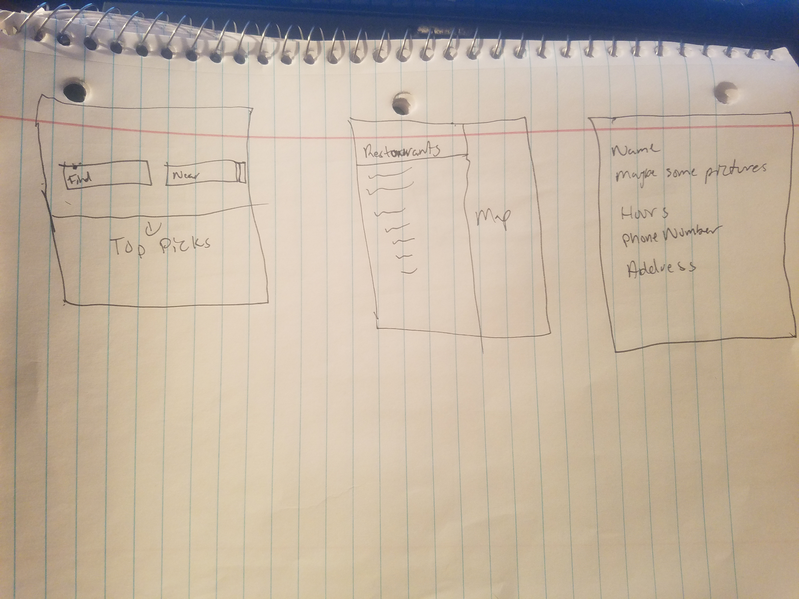
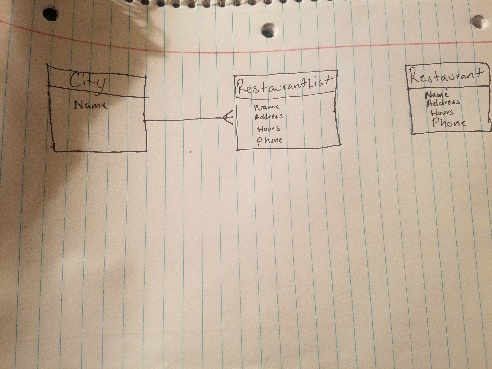

# Project 3
## Problem Statement
This app was created to find the best and most convinent restaurants, based on the city searched. This application allows a user to search for a city of their choice. Based on the city searched, a list of restaurants in that area will populate. This makes it easy for users to locate restaurant and have the information to such restaurant. 

# Deployed App
Heroku app: [Here](https://fathomless-brook-06026.herokuapp.com/cities)

# Wireframe

# ERD 

# Version
Version 1.0

# Technologies Used
1. Mongo.DB
2. Express.js
3. React
4. Node.js
